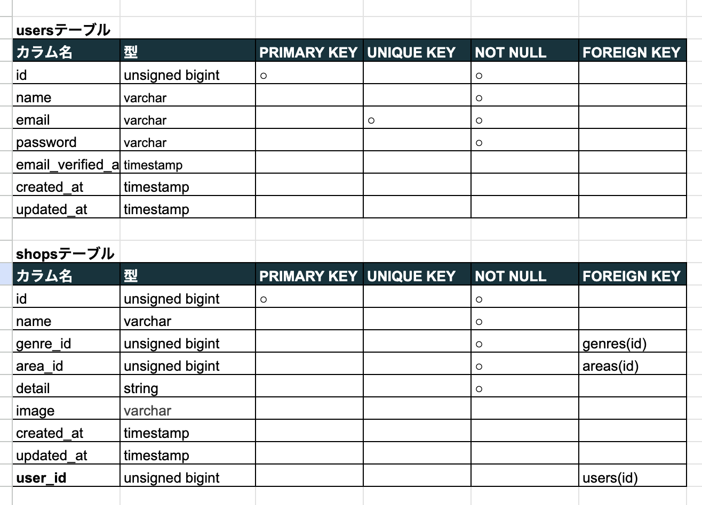
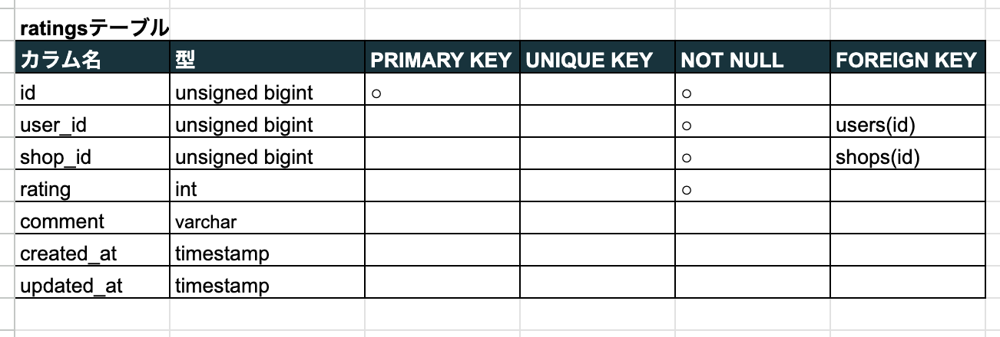

# Rese(予約システムアプリ)
- 東京、大阪、福岡のおすすめ飲食店の予約アプリ。
- 来店時にはQRコードにて予約確認できます。
- 来店後の評価・口コミ投稿できます。
- 随時、店舗登録が可能。(削除も可能)

## 誰でも簡単に予約でき、店舗側も簡単に予約管理ができるアプリを作成したかった。
お気に入り機能で気になる店舗を保存でき、店舗詳細ページでは日時と人数を選ぶだけで簡単に予約を取れると便利で多くの方が使いやすいと思い作成。
ややこしい機能がないのでどんな方でも気軽に利用していただけるようなアプリが喜ばれると思いましいた。

## http://localhost/

### 注意事項
ログイン画面になるのでこちらを参照

**管理者**

メールアドレス:rinnyomu.komachi@gmail.com

パスワード:1111

**店舗代表者**

メールアドレス:rin.komachi.yoko@gmail.com

パスワード:1111

**一般ユーザー**

会員登録にて名前、メールアドレス、パスワードを設定すればログイン可能。

## リポジトリ構成
本プロジェクトはLaravelを使用しており、バックエンドとフロントエンドの両方を1つのリポジトリで管理しています。Bladeテンプレートエンジンを使用してフロントエンドのビューを構築しています。

## 機能一覧
- 会員登録
- ログイン/ログアウト
- メール認証
- ユーザー情報取得
- 飲食店一覧取得
- 飲食店詳細取得
- お気に入り一覧取得
- お気に入り追加/削除
- ユーザー飲食店予約情報取得
- 店舗予約/キャンセル/変更
- エリアで検索する
- ジャンルで検索する
- 店名で検索する
- 管理者による店舗代表者登録
- 店舗代表者による店舗登録/編集
- 認証と予約の際にバリデーション
- QRコードで予約情報取得
- 評価、コメント投稿
- 予約のリマインダーメール
- 管理者からのお知らせメール一斉送信
- Stripeを利用しての決済機能
- 画像のストレージ保存

## 使用技術(実行環境)
**言語**
    PHP
    JavaScript

**フレームワーク**
    Laravel Framework 8.83.8

**実行環境**

### インフラストラクチャ
- Docker Compose: バージョン 3.8
- Nginx: 1.21.1
- MySQL: 8.0.26
- PHP: 7.4.9
- PHPMyAdmin: 5.2.1

### ポート設定
- Web: 80番ポート
- PHP: 8000番ポート
- PHPMyAdmin: 8080番ポート

### データベース
- データベース名: laravel_db
- ユーザー名: laravel_user

## テーブル設計

## ER図

# 環境構築

このアプリケーションをローカルで動作させるには、以下の手順に従ってください。

## 前提条件

このプロジェクトを始めるには、以下のツールがインストールされている必要があります：

- [Docker](https://www.docker.com/)（バージョン 20.x 以上推奨）
- [Docker Compose](https://docs.docker.com/compose/)（バージョン 1.29.2 以上推奨）
- git（プロジェクトをクローンするため）

---

## 環境構築手順

### 1.リポジトリをクローン
   以下のコマンドでプロジェクトをクローンします：

   git clone https://github.com/yokoyonezawa/rese-1

### 2.env ファイルを作成
プロジェクトルートに .env ファイルを作成し、以下をコピーして貼り付けます（環境に応じて編集してください）。

APP_NAME=Laravel
APP_ENV=local
APP_KEY=base64:xxxxxxxxxxxxxxxxxxxxxxxxxxxxxxxx
APP_DEBUG=true
APP_URL=http://localhost:8000

DB_CONNECTION=mysql
DB_HOST=mysql
DB_PORT=3306
DB_DATABASE=laravel_db
DB_USERNAME=laravel_user
DB_PASSWORD=laravel_pass

### 3. Dockerコンテナをビルドして起動
次のコマンドを実行して、コンテナを構築して起動します。

-bash-

docker-compose up -d --build

### 4. データベースのマイグレーションと初期データ設定
以下のコマンドを使って、データベースをセットアップします。

-bash-

docker exec -it {phpコンテナ名} bash
php artisan migrate --seed

### 5. ブラウザでアクセス
サービスが正しく起動していれば、次のURLでアプリケーションにアクセスできます。

http://localhost:8000

### Docker構成ファイルの説明
このプロジェクトでは、以下のサービスをDockerで構築しています：

- nginx: フロントエンドウェブサーバー。(1.21.1)
- php: アプリケーションの実行環境（PHP 7.4.9）。
- mysql: データベース（MySQL 8.0.26）。
- phpmyadmin: データベース管理ツール。(8.0.26)

### トラブルシューティング

- エラーが発生する場合

ログを確認して問題を特定します

-bash-

docker-compose logs

- Laravelキャッシュのクリア

Laravelのキャッシュが原因で問題が発生している場合、以下を実行します。

-bash-

php artisan config:clear

php artisan cache:clear

php artisan route:clear

## アカウントの種類
- 管理者
- 店舗代表者
- 一般ユーザー

権限は３つ。ログイン時は上記の注意事項を参照。